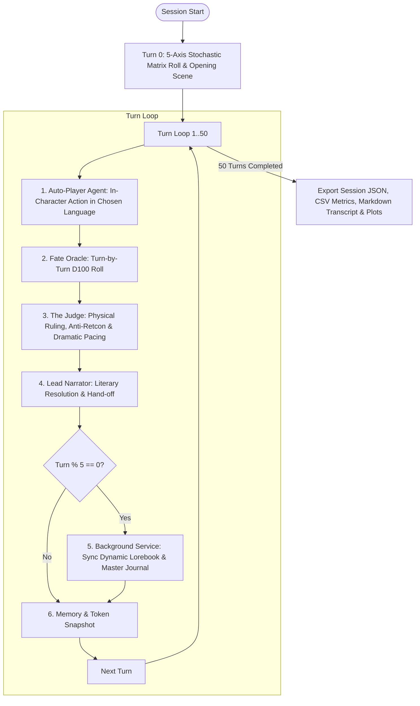

# 🎲 OmniTale — Autonomous LLM Benchmark & Evaluation Suite

A standalone, Kaggle-ready evaluation suite for benchmarking small open-weights LLMs (7B – 14B) on **OmniTale's multi-agent tabletop RPG architecture**.

It simulates long-context game sessions (e.g. 50+ turns, ~25K–30K tokens) without human intervention, profiling token consumption, inference speed, **process RAM and GPU VRAM memory footprint**, and narrative coherence to evaluate configurations for domestic hardware (such as laptops with 8 GB VRAM).

---

## 📁 Directory Structure

```text
llm-evaluation/
├── kaggle_omnitale_eval.ipynb   # Ready-to-run Jupyter notebook for Kaggle / Colab (GPU accelerated)
├── evaluate.py                  # Standalone CLI benchmark runner (argparse)
├── requirements.txt             # Python dependencies (llama-cpp-python, psutil, pandas, matplotlib, etc.)
├── README.md                    # This documentation guide
├── omnitale_engine/             # Python port of OmniTale core engine & prompts
│   ├── __init__.py
│   ├── types.py                 # Dataclasses matching OmniTale TypeScript models
│   ├── dice.py                  # D100 Fate Oracle & 5-Axis Stochastic Matrix
│   ├── memory.py                # Memory profiler (Process RAM & GPU VRAM tracking)
│   ├── prompts.py               # Faithful prompt generators (Turn 0, Judge, Narrator, Lorebook, Journal)
│   ├── templates.py             # Scenario loader (Eldoria, Sector 7, Deep Ice, custom JSON)
│   ├── llm_backend.py           # Backends: LlamaCpp (GGUF), OpenAI-compatible (Ollama/vLLM), Mock
│   ├── auto_player.py           # In-character simulated human player agent
│   └── engine.py                # Full multi-turn game loop, metrics recorder, and exporters
└── templates/                   # JSON exports of starter scenarios
    ├── eldoria.json
    └── sector7.json
```

---

## 🕹️ How It Works: The OmniTale Multi-Stage Pipeline

During each simulation run, the engine executes the complete OmniTale architecture:



---

## 🚀 Running on Kaggle

1. Create a new notebook on [Kaggle](https://www.kaggle.com/).
2. Enable GPU acceleration (**Settings** -> **Accelerator** -> **GPU T4 x2** or **P100**).
3. Upload or copy the `/llm-evaluation` folder to `/kaggle/working/llm-evaluation`.
4. Open `kaggle_omnitale_eval.ipynb` and run all cells sequentially.

---

## 💻 Running Locally via CLI (`evaluate.py`)

### 1. Installation

```bash
cd llm-evaluation
pip install -r requirements.txt

# For CUDA acceleration with llama-cpp-python:
CMAKE_ARGS="-DGGML_CUDA=on" pip install llama-cpp-python
```

### 2. Run with a GGUF Model (Auto-downloaded from Hugging Face)

```bash
python3 evaluate.py \
  --backend llamacpp \
  --hf-repo bartowski/Qwen2.5-7B-Instruct-GGUF \
  --hf-file Qwen2.5-7B-Instruct-Q4_K_M.gguf \
  --template collective-flame \
  --language English \
  --turns 50 \
  --ctx-size 28000 \
  --gpu-layers -1 \
  --cache-type q8_0 \
  --output-dir ./results_qwen7b
```

### 3. Run with an existing local GGUF file

```bash
python3 evaluate.py \
  --backend llamacpp \
  --model-path /path/to/my-model.gguf \
  --template sector7 \
  --language English \
  --turns 50 \
  --output-dir ./results_local
```

### 4. Run with a local Ollama / LM Studio server

```bash
python3 evaluate.py \
  --backend openai \
  --api-url http://localhost:11434/v1 \
  --model-name llama3.1:8b \
  --language Italian \
  --turns 50 \
  --output-dir ./results_ollama
```

### 5. Dry-Run Mode (Mock Backend for quick pipeline test)

```bash
python3 evaluate.py --backend mock --turns 10 --language Italian --output-dir ./results_mock
```

---

## 📊 Evaluation Outputs & Metrics

Every simulation saves the following artifacts inside `--output-dir`:

| File | Description |
|---|---|
| `story_transcript.md` | Full narrative transcript formatted like an interactive novel with Judge notes & Fate rolls. |
| `session_log.json` | Complete raw state dump (messages, dynamic lorebook state, journal history, judge scratchpad). |
| `turns_metrics.csv` | Granular table containing per-turn latency, tokens per second, prompt vs completion tokens, cumulative context size, **Process RAM (MB)**, and **GPU VRAM (MB)**. |
| `metrics_summary.json` | High-level summary with total execution time, throughput, peak RAM/VRAM, and stage breakdown. |
| `plots/*.png` | Visualization charts (Token consumption, Latency progression, Cumulative context growth, RAM & GPU VRAM memory). |

---

## 🎯 8GB VRAM Laptop Sizing & Configuration Guide

For users running OmniTale locally on domestic laptops with **8 GB VRAM** (e.g. NVIDIA RTX 3060 / 3070 / 4060 Mobile GPUs), context window management is key.

### VRAM Budget Breakdown (28K Context Window)

| Component | Standard FP16 KV Cache | Quantized `q8_0` KV Cache | Quantized `q4_0` KV Cache |
|---|---|---|---|
| **7B Model Weights (Q4_K_M)** | ~4.3 GB | ~4.3 GB | ~4.3 GB |
| **KV Cache (28K Context)** | ~7.0 GB ⚠️ | ~3.5 GB ✅ | ~1.8 GB 🚀 |
| **CUDA & PyTorch Overhead** | ~0.5 GB | ~0.5 GB | ~0.5 GB |
| **Total VRAM Required** | **~11.8 GB** *(OOM on 8GB)* | **~8.3 GB** *(Tight fit)* | **~6.6 GB** *(Safe headroom)* |

> [!TIP]
> **Recommended Production Settings for 8GB VRAM:**
> 1. Use **Q4_K_M** or **Q4_0** model quantization (e.g. `Qwen2.5-7B-Instruct-Q4_K_M.gguf`).
> 2. Enable **Flash Attention** (`--flash-attn`).
> 3. Enable **8-bit or 4-bit KV cache quantization** (`--cache-type-k q8_0 --cache-type-v q8_0` or `q4_0`).
> 4. In `llama-server`:
>    ```bash
>    ./llama-server \
>      -m qwen2.5-7b-instruct-q4_k_m.gguf \
>      -c 28000 \
>      -ngl 99 \
>      --flash-attn \
>      --cache-type-k q8_0 \
>      --cache-type-v q8_0 \
>      --port 8080
>    ```

---

## 🏆 Recommended Small Models for OmniTale

1. **Qwen 2.5 7B Instruct (Q4_K_M)**: Outstanding multi-lingual capabilities (especially Italian), strict instruction adherence for the Judge format, and low perplexity over long context.
2. **Meta Llama 3.1 8B Instruct (Q4_K_M)**: Native 128k context support, robust reasoning and natural dialogue.
3. **Gemma 2 9B IT (Q4_K_M)**: Rich literary narrative prose, excellent for atmospheric fantasy and sci-fi.
